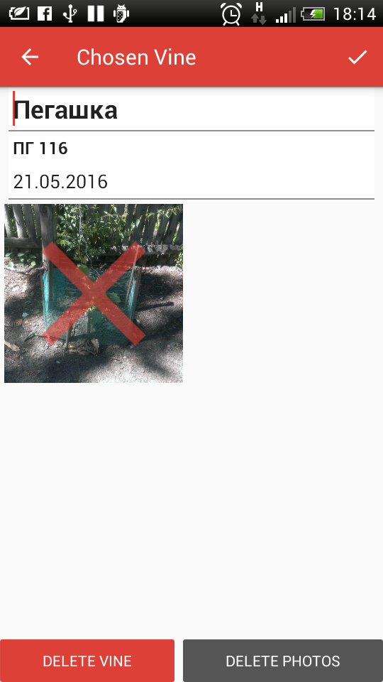

# My Vine

designed by Uriy Opanasenko

powered by Picasso

This is a program for a garden photo album.

Main purpose of this app is for user to make and save photots of his or hers plants.

Right now info about plants is saved only on device.

List of plants on home activity:

User can add new plant:

User can view info about plant:

User can add photos and write descriptions to them:

User can edit plant:

and delete it:

User can delete photos:

Entrance is not working yet, you can click on any button and home activity will be opened

